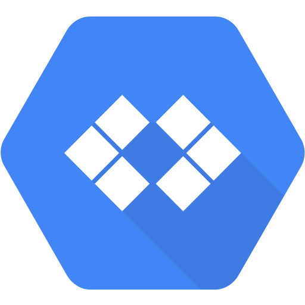

# Awesome [Cloud Code](https://cloud.google.com/code/) 

> A curated list of resources about all things [Cloud Code](https://cloud.google.com/code/). Feel free to send Pull Requests!

*Inspired by the [awesome](https://github.com/sindresorhus/awesome) list project.*

Cloud Code is on [StackOverflow](https://stackoverflow.com/questions/tagged/google-cloud-code)

*Legend*: 📙: doc, 📰: article, 📦: sample, 🎬: video, 🖼️: slides, ✏️: interactive tutorial, :headphones: : audio, 🛠️: tool

## Get Cloud Code

* [Cloud Code for VS Code](https://marketplace.visualstudio.com/items?itemName=GoogleCloudTools.cloudcode)
* [Cloud Code for IntelliJ](https://plugins.jetbrains.com/plugin/8079-cloud-code)

## Documentation

* 📙 [Cloud Code Official Documentation](https://cloud.google.com/code/docs/) | [VS Code](https://cloud.google.com/code/docs/vscode) | [IntelliJ](https://cloud.google.com/code/docs/intellij)

### Cloud Code for VS Code

#### Quickstarts

* 📙 [Running a Kubernetes app with Cloud Code](https://cloud.google.com/code/docs/vscode/quickstart-local-dev)
* 📙 [Deploying a Cloud Run app with Cloud Code](https://cloud.google.com/code/docs/vscode/quickstart-cloud-run)

### Cloud Code for IntelliJ 

#### Quickstarts

* 📙 [Running a Kubernetes app with Cloud Code](https://cloud.google.com/code/docs/intellij/quickstart-k8s)
* 📙 [Deploying a Cloud Run app with Cloud Code](https://cloud.google.com/code/docs/intellij/quickstart-cloud-run)

### Interactive tutorials

* ✏️ Coming soon...

## Articles

* 📰 [Cloud Code makes YAML easy for hundreds of popular Kubernetes CRDs](https://cloud.google.com/blog/products/containers-kubernetes/cloud-code-features-expanded-support-for-kubernetes-crds)
* 📰 [Streamlining Cloud Run development with Cloud Code](https://cloud.google.com/blog/products/application-development/cloud-run-is-integrated-with-cloud-code)
* 📰 [Now, you can explore Google Cloud APIs with Cloud Code](https://cloud.google.com/blog/products/application-development/how-cloud-code-improves-app-dev-on-gcp)
* 📰 [Stackdriver Logging comes to Cloud Code in Visual Studio Code](https://cloud.google.com/blog/products/application-development/stackdriver-logging-comes-to-cloud-code-in-visual-studio-code)
* 📰 [Announcing Cloud Code—accelerating cloud-native application development](https://cloud.google.com/blog/products/devops-sre/announcing-cloud-code-accelerating-cloud-native-application-development)

## Videos

### Short Feature Overview Videos

* 🎬 [Develop Kubernetes with Cloud Code (Showcase at Next ‘20 OnAir)](https://www.youtube.com/watch?v=KNd0mTxcQ_M)

### Conference sessions (with demos) 

* 🎬 [Cloud-Native DevOps with Kubernetes and Serverless (Cloud Next ‘19 UK)](https://www.youtube.com/watch?v=kpKIHmAfyyM) - [\[skip to IntelliJ demo\]](https://www.youtube.com/watch?v=kpKIHmAfyyM&t=897)
* 🎬 [Anthos-Native Developer Experience for IDE's using Cloud Code (Cloud Next ‘19 UK)](https://youtu.be/jmlFm2eZ5Ug)
* 🎬 [Next '19 London Keynote by Google Cloud's CEO and the president of EMEA - Cloud Code remote development demo](https://www.youtube.com/watch?v=jJ1C43A90fE&feature=youtu.be&t=3447)
* 🎬 [Kubernetes and VS Code: Zero to Deployed (Cloud Next '19)](https://www.youtube.com/watch?v=Ns0fHKuv7_Y)
* 🎬 [Dead Easy Kubernetes Workflows With VS Code (Cloud Next '19)](https://www.youtube.com/watch?v=62GLbBDLiPE)
* 🎬 [Develop Faster on Kubernetes With Google Container Tools and Cloud Build (Cloud Next '19)](https://www.youtube.com/watch?v=TYx0BTyFtmc)

## Podcast episodes

* :headphones: [Kubernetes Podcast - Episode #64: Cloud Code, with Sarah D'Angelo and Patrick Flynn](https://kubernetespodcast.com/episode/064-cloud-code/)
* :headphones: [GCP Podcast - Episode 204. End to End Java on Google Cloud with Ray Tsang](https://www.gcppodcast.com/post/episode-204-end-to-end-java-on-google-cloud-with-ray-tsang/)

## Help

* Use the [`google-cloud-code` tag on StackOverflow](https://stackoverflow.com/questions/tagged/google-cloud-code)
* Join the **#cloud-code** channel in the [Google Cloud Platform Slack community](https://join.slack.com/t/googlecloud-community/shared_invite/zt-erdf4ity-8ZMUQ18DYV~5hkbZ~gCswg) to ask questions, provide feedback, and get the latest Cloud Code news

## Container tools

### Workflow

* [Skaffold](https://skaffold.dev/) powers the Kubernetes and Cloud Run workflows inside Cloud Code and is usable independently on the CLI

### Building Containers 

Cloud Code lets you build containers using: 
* 📙 [Dockerfiles](https://docs.docker.com/engine/reference/builder/): Build container images as defined in a dockerfile. Learn about [best practices](https://blog.docker.com/2019/07/intro-guide-to-dockerfile-best-practices/).
* 📰 [Buildpacks](https://buildpacks.io/): Build container images without providing any definition for Java, Go, NodeJS, Python, and .NET
* 📦 Java [Jib](https://github.com/GoogleContainerTools/jib): Build container images for your Java applications.

### Running Containers 
* [Minikube](https://minikube.sigs.k8s.io/docs/) is automatically installed with Cloud Code and is used to run your Kubernetes and Cloud Run apps locally.
* [Docker Desktop](https://www.docker.com/products/docker-desktop)

## Samples and microservices
* [Cloud Code Samples](https://github.com/GoogleCloudPlatform/cloud-code-samples): Samples for new Kubernetes and Cloud Run apps in Java, Go, Node, Python, and .NET that are accessible from inside your IDE with Cloud Code.
